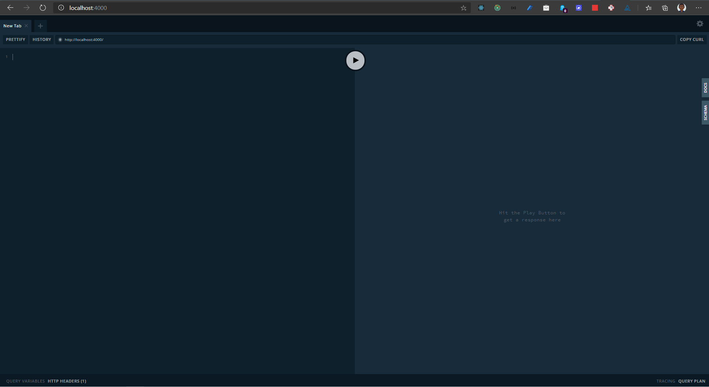

# 🚀 GraphQL Introduction with Apollo Server

This repo contains example code to help you get started in your journey building GraphQL APIs 💪🏾

### Clone the Repository:

```bash
git clone git@github.com:MicrosoftStudentAmbassadors-Kenya/GraphQL-Intro.git
```

### Navigate to the working directory:

```bash
cd GraphQL-Intro
```

### Install the dependencies:

```bash
npm install # or alternatively yarn 
```

### Start the Server:

```bash
npm start # or run yarn start
```

This runs the API in development mode
Open [http://localhost://4000](http://localhost:4000) to interact with the ⚛ GraphQL Playground

Your GraphQL Playground should look something similar to this:



Try out your first query!

```gql
query GET_BOOKS {
  books{
    id 
    title
    author
    published
  }
}
```

Press the Play button.... and we have lift off 👩🏾‍🚀👨🏾‍🚀🚀🚀

Congratulations! You just made your first GraphQL query 🎉🍾

**This repository uses an in-memory database**

Feel free to extend the starter code by connecting it to an existing database or integrate it with a REST API😉 

### Learn More:
Explore building GraphQL APIs with [Apollo Server](https://www.apollographql.com/docs/apollo-server/getting-started/#step-3-define-your-graphql-schema)

Dive deeper into GraphQL fundamentals at [https://www.howtographql.com/](https://www.howtographql.com/)
