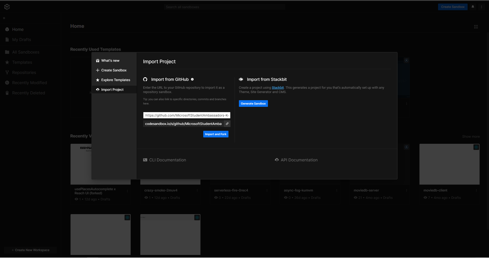
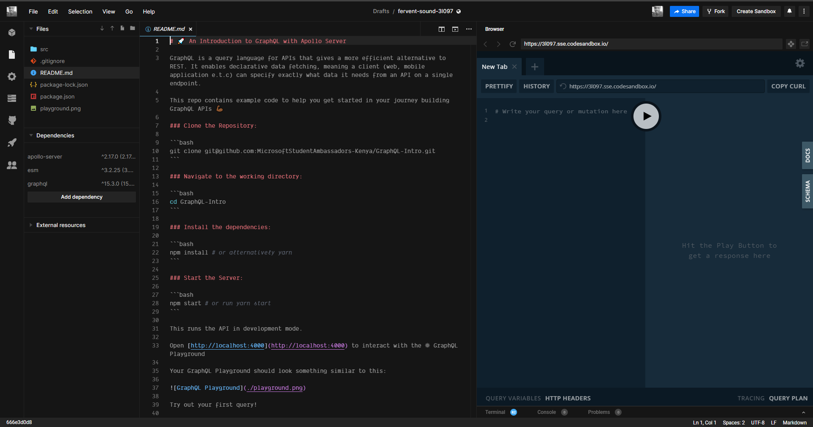
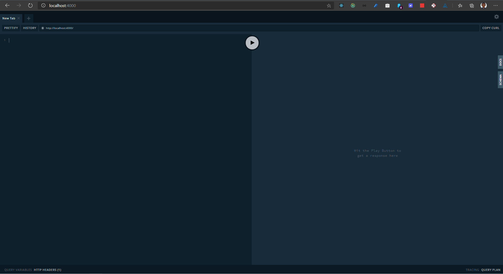

# 🚀 An Introduction to GraphQL with Apollo Server

GraphQL is a query language for APIs that gives a more efficient alternative to REST. It enables declarative data fetching, meaning a client (web, mobile application e.t.c) can specify exactly what data it needs from an API on a single endpoint.

This repo contains example code to help you get started in your journey building GraphQL APIs 💪🏾

## Get Started using Codesandbox 📦

Codesandbox is an online IDE for quickly building web applications. 🏎 

Create a free account on [Codesandbox](https://codesandbox.io) if you don't have one yet. 😉

Once you have signed in, select create a new sandbox which will be at the top right of the page. On the popup that shows up on the page, select import project option and under the `Import from Github` section, paste in the following link: `https://github.com/MicrosoftStudentAmbassadors-Kenya/GraphQL-Intro.git`. Once you are done, click import and fork.

You should see something that resembles this before selecting import and fork.: 



 Give it a moment to start up.... and ...⏲... done!

 Your screen should resemble this:

 

 If you've gotten this far, head over to the section on [Trying your first query](#try-out-your-first-query) 🎉🎉

## Get Started Locally

### Clone the Repository:

```bash
git clone git@github.com:MicrosoftStudentAmbassadors-Kenya/GraphQL-Intro.git
```

### Navigate to the working directory:

```bash
cd GraphQL-Intro
```

### Install the dependencies:

```bash
npm install # or alternatively yarn 
```

### Start the Server:

```bash
npm start # or run yarn start
```

This runs the API in development mode.

Open [http://localhost:4000](http://localhost:4000) to interact with the ⚛ GraphQL Playground

Your GraphQL Playground should look something similar to this:



### Try out your first query! 🛒

```gql
query GET_BOOKS {
  books{
    id 
    title
    author
    published
  }
}
```

Press the Play button.... and we have lift off 👩🏾‍🚀👨🏾‍🚀🚀🚀

Congratulations! You just made your first GraphQL query 🎉🍾

**This repository uses an in-memory database**

Feel free to extend the starter code by connecting it to an existing database or integrate it with a REST API😉

You can make this repo your own by forking it as well 😀 

Give this repo a ⭐ to help others find it.

### Learn More:
Dive deeper into GraphQL fundamentals at [https://www.howtographql.com/](https://www.howtographql.com/)

Explore building GraphQL APIs with [Apollo Server](https://www.apollographql.com/docs/apollo-server/getting-started/)
